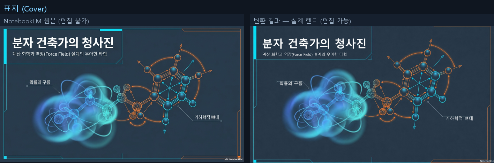
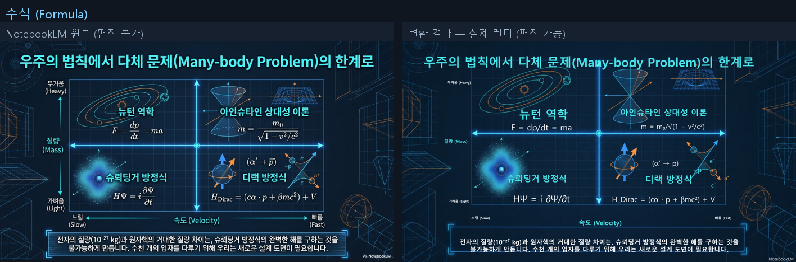
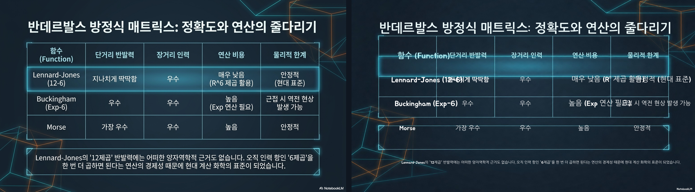

# nlm-to-editable-pptx

NotebookLM(또는 이미지 기반/스캔) PPTX·PDF 덱을 **편집 가능한 PowerPoint**로 변환하는 Claude Code 스킬.

NotebookLM이 내보낸 슬라이드는 각 페이지가 통이미지라 글자를 선택·편집할 수 없습니다.
이 스킬은 (1) 배경에서 글자를 지우고 (2) 글자를 위치·크기·색까지 다시 인식해서
(3) 깨끗한 배경 위에 진짜 편집 가능한 텍스트박스를 얹은 새 `.pptx`를 만듭니다.
원본의 그림·도표·색감은 유지되고, 한국어와 수식도 처리됩니다.

## 파이프라인

```
입력(pptx/pdf) → 슬라이드 PNG 추출 → [글자 제거: gpt-image-2] + [OCR: gpt-5.5] → pptx 조립
```

## 결과 비교 (원본 → 변경 후)

각 쌍의 **왼쪽이 NotebookLM 원본**(통이미지, 편집 불가), **오른쪽이 변환 결과를
실제 PowerPoint/LibreOffice로 렌더한 모습**(원본 글자를 제거한 배경 위에 편집 가능한 텍스트).
한국어·수식·표가 모두 편집 가능한 텍스트로 재구성되며, 텍스트 위치·크기·줄바꿈이 원본에
맞도록 조정됩니다.

**표지**


**수식 슬라이드** (LaTeX가 아닌 읽기 쉬운 유니코드로: `m₀/√(1−v²/c²)`)


**표 슬라이드**


- 12슬라이드 전체 비교: [`examples/comparison.html`](examples/comparison.html) (내려받아 브라우저로 열기)
- **입력 샘플** (NotebookLM 원본, 편집 불가 통이미지): [`examples/sample_input_notebooklm.pptx`](examples/sample_input_notebooklm.pptx)
- **출력 샘플** (변환 결과, 편집 가능): [`examples/sample_output.pptx`](examples/sample_output.pptx)

입력→출력 쌍이 함께 있으니, 직접 `python scripts/nlm2pptx.py examples/sample_input_notebooklm.pptx my_output.pptx`
로 재현해 결과를 비교해 볼 수 있습니다.

## 설치

```bash
pip install -r requirements.txt          # python-pptx, pillow, (pdf면) pymupdf
export OPENAI_API_KEY=sk-...              # Windows: setx OPENAI_API_KEY "sk-..."
```

Claude Code 스킬로 쓰려면 이 폴더를 `~/.claude/skills/nlm-to-editable-pptx/` 에 두면 됩니다
(Windows: `%USERPROFILE%\.claude\skills\nlm-to-editable-pptx\`).

## 사용

### CLI

```bash
python scripts/nlm2pptx.py input.pptx output.pptx
python scripts/nlm2pptx.py deck.pdf out.pptx --no-erase      # 빠른 모드(글자제거 생략)
python scripts/nlm2pptx.py input.pptx out.pptx --workers 6   # 병렬(기본 6, 1=순차)
python scripts/nlm2pptx.py input.pptx out.pptx --workdir ./wd  # 중간파일+convert.log 보존
```

슬라이드별 글자제거/OCR은 기본 6스레드 병렬(12장 기준 전체 ~7분, `--no-erase` ~2.5분).
`--workdir` 를 주면 `convert.log` 에 슬라이드별 소요시간·재시도·에러가 기록됩니다.

### Python (노트북 / 웹앱 / Databricks)

```python
from nlm2pptx import convert
convert("input.pptx", "output.pptx")            # 전체
convert("input.pdf",  "out.pptx", erase=False)  # 빠른 모드
```

개별 단계(`extract_slides`, `erase_text`, `ocr_slide`, `build_pptx`)도 import 가능해
슬라이드 단위 병렬화가 쉽습니다. 자세한 내용은 `references/architecture.md`.

### 검증

```bash
python scripts/nlm2pptx.py input.pptx out.pptx --workdir ./wd
python scripts/compare_html.py --workdir ./wd --out comparison.html   # 원본 vs 결과 비교
```

## 환경 변수

| 변수 | 기본값 | 설명 |
|---|---|---|
| `OPENAI_API_KEY` | (필수) | OpenAI API 키 |
| `OPENAI_BASE_URL` | `https://api.openai.com/v1` | 게이트웨이/Azure 등 |
| `NLM2PPTX_IMAGE_MODEL` | `gpt-image-2` | 글자 제거 모델 |
| `NLM2PPTX_OCR_MODEL` | `gpt-5.5` | OCR 모델 |
| `NLM2PPTX_FONT` | `맑은 고딕` | pptx에 기입할 폰트명 |

## 참고

- 글자 제거는 슬라이드당 이미지 모델을 1회 호출(~30–60초). 12장이면 수 분 소요.
  속도/비용이 중요하면 `--no-erase`(글자 제거 없이 텍스트만 오버레이).
- 수식은 편집 가능한 유니코드 평문으로 변환(`m₀/√(1−v²/c²)`)됩니다.
- `gpt-image-2`는 `gpt-image-1-mini`보다 원본 그림/표를 충실히 보존합니다(기본값 유지 권장).

## 라이선스

MIT
